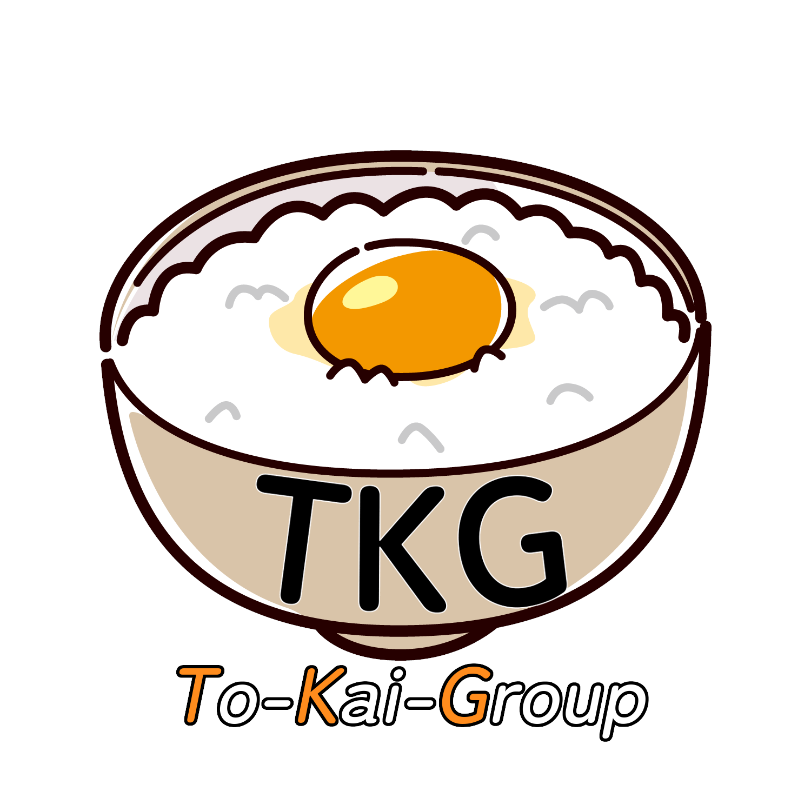
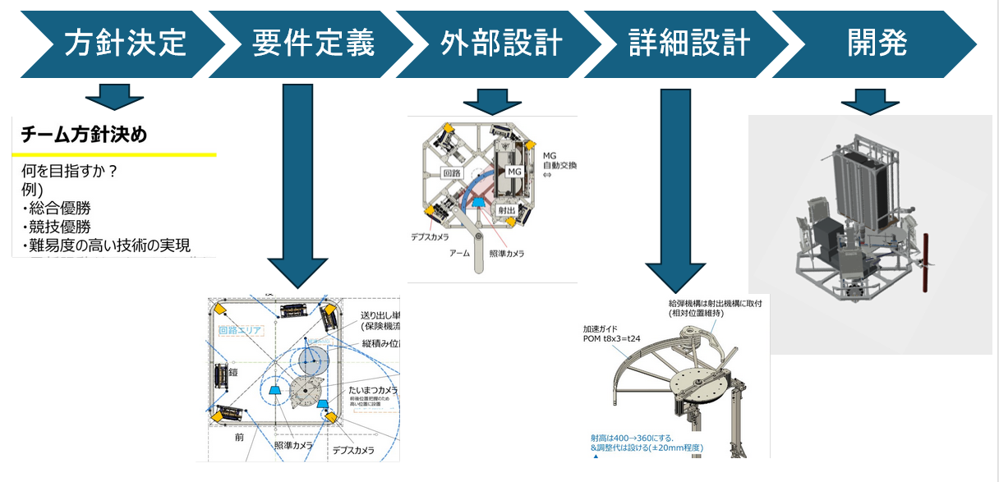

# TKG Wiki

## TKGについて

[CoRE](https://core.scramble-robot.org/)というエンジニア選手権に出場するために結成された東海地方4社の社会人連合チームです。メンバーにはお酒好きが多く、お酒がエネルギー源です。前回大会の目標は「技術賞・個人賞の受賞」でした。革新的技術賞を受賞できましたが、各構成要素の信頼性が低く同盟戦では活躍できませんでした。2024年度は「各構成要素の信頼性向上」により同盟戦で活躍できるロボットを開発することで、総合優勝を目指します！x（旧Twitter）上の#CoREJP_TKGで進捗状況や技術資料を公開中です。微力ながら大会を盛り上げていきますので、どうぞよろしくお願いします。

## 本Wikiの内容について

各出場年毎に作成した設計検討資料をアップロードしています。内容として、ウォーターフォール型開発モデルに基づく方針決定、外部設計、詳細設計の検討資料に加えて、作成したロボットの3DCADデータや回路基板データがあります。詳しい情報は各年毎のREADMEを参照してください。

